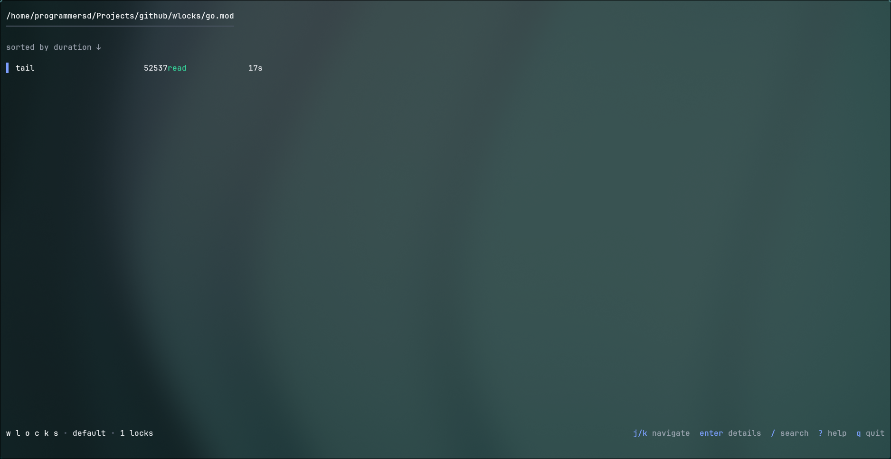

# wlocks

[](https://go.dev)
[](LICENSE)
[](https://github.com/programmersd21/wlocks/releases)
[](https://github.com/programmersd21/wlocks/actions)
[](https://goreleaser.com)



a terminal tool that shows which processes have which files open. an `lsof`/`fuser` alternative with a real interface.

## design principles

**calm, colorful, breathable.** minimal because everything earns its place.

- never touches terminal background - works on any terminal theme
- lowercase ui copy everywhere
- no borders, boxes, ascii art, emoji, or nerd fonts
- whitespace as primary layout tool
- instant startup, progressive population
- smooth animations and visual feedback

## features

### core
- **auto-refresh** - continuously monitors file access, polls every 2 seconds
- **detail view** - expanded process information (pid, cmdline, cwd, fd count)
- **fuzzy search** - filter results live with `/` key
- **smart sorting** - sort by name, duration, pid, or mode (with reverse)

### interface
- **theme system** - six hand-tuned themes, cycle with `T`
- **smooth animations** - 60fps transitions and scrolling with cubic easing
- **command palette** - quick access to all actions with `ctrl+p`
- **interactive help** - press `?` anytime to see available commands
- **statistics view** - see aggregate info with `i`
- **status notifications** - ephemeral feedback for all actions

### experience
- **keyboard-driven** - zero mouse required
- **respects terminals** - detects tty, falls back to plain text for pipes
- **persistent config** - theme preference saved to `~/.config/wlocks/config.toml`
- **visual hierarchy** - smart use of color, spacing, and typography

## installation

### from releases

download the latest linux binary from [github releases](https://github.com/programmersd21/wlocks/releases):

```bash
# linux amd64
curl -L https://github.com/programmersd21/wlocks/releases/latest/download/wlocks_linux_amd64.tar.gz | tar xz
sudo mv wlocks /usr/local/bin/

# linux arm64
curl -L https://github.com/programmersd21/wlocks/releases/latest/download/wlocks_linux_arm64.tar.gz | tar xz
sudo mv wlocks /usr/local/bin/
```

### from source

requires go 1.24+

```bash
git clone https://github.com/programmersd21/wlocks.git
cd wlocks
go build -o wlocks ./cmd/wlocks
sudo mv wlocks /usr/local/bin/
```

## usage

```bash
# show which processes hold the current working directory
wlocks

# show which processes hold a specific file
wlocks /path/to/file

# override theme for this session
wlocks --theme tokyo /path/to/file

# enable debug output
wlocks --debug /path/to/file
```

## keyboard shortcuts

### navigation
| key | action |
|-----|--------|
| `j`/`k` or `↑`/`↓` | navigate list |
| `enter` | show process details |
| `esc` | go back / clear search |

### actions
| key | action |
|-----|--------|
| `/` | search processes |
| `r` | refresh snapshot |
| `K` | kill process (with confirm) |
| `s` | cycle sort mode (name/duration/pid/mode) |
| `S` | reverse sort order |

### views
| key | action |
|-----|--------|
| `?` | show help |
| `i` | show statistics |
| `ctrl+p` | command palette |

### customization
| key | action |
|-----|--------|
| `T` | cycle theme |

### other
| key | action |
|-----|--------|
| `q` | quit |
| `ctrl+c` | force quit |

## themes

six hand-tuned themes, not palette swaps:

- `default` - desaturated neutral, single blue accent
- `tokyo` - tokyo night derived, deep blues and purples
- `catppuccin` - mocha variant, soft pastels
- `everforest` - soft green forest, earthy tones
- `nord` - arctic, ice-cold pastels
- `gruvbox` - retro groove, warm contrast

set with `--theme <name>`, persisted to `~/.config/wlocks/config.toml`, cycle at runtime with `T`.

## auto-refresh

wlocks continuously polls `/proc` every 2 seconds to detect changes. when processes open or close a file, the list updates automatically and status messages appear showing the delta (e.g. `+2 new`, `3 closed`).

press `r` to force an immediate refresh at any time.

## sorting

sort results by different criteria:
- **name** - alphabetical by process name
- **duration** - how long the file has been open (default)
- **pid** - numerical process id
- **mode** - read vs write access

press `s` to cycle through sort modes, `S` to reverse the order.

## configuration

config file location: `~/.config/wlocks/config.toml`

```toml
theme = "tokyo"
```

theme preference is persisted automatically when set with `--theme`.

## how it works

### linux /proc internals

wlocks scans `/proc/[pid]/fd/*` to discover open files. key implementation details:

- **path resolution**: uses `readlink` on fd symlinks, resolves via `filepath.EvalSymlinks` to handle bind mounts and symlinks correctly
- **read vs write mode**: parses `/proc/[pid]/fdinfo/[fd]` flags field, decodes `O_ACCMODE` bits (0=read, 1=write, 2=rdwr) - never guesses from symlink
- **process metadata**: reads `/proc/[pid]/comm`, `/proc/[pid]/cmdline` (null-separated), `/proc/[pid]/cwd`, `/proc/[pid]/exe`
- **permissions**: gracefully skips processes with EACCES, counts in debug mode
- **auto-refresh**: polls `/proc` at 2-second intervals (procfs doesn't generate inotify events since it's synthetic)

### animations

all animations use cubic bezier easing functions for natural motion:
- **list scrolling** - smooth interpolation between positions
- **view transitions** - fade in/out with ease-in-out curves
- **60fps** - 16ms tick rate for butter-smooth updates

### project structure

```
wlocks/
  cmd/wlocks/
    main.go              # cli entry point
  internal/
    proc/
      fd.go              # file descriptor resolution, O_ACCMODE parsing
      process.go         # process metadata extraction
      scan.go            # /proc walking, snapshot, diffing
    ui/
      model.go           # bubbletea root model, mode switching
      list.go            # static list view rendering
      detail.go          # detail view rendering
      search.go          # fuzzy search with sahilm/fuzzy
      palette.go         # command palette overlay
      help.go            # interactive help view
      keys.go            # keybindings
      theme.go           # theme definitions, style builder
      animation.go       # animation utilities and easing functions
    config/
      config.go          # toml config persistence
    app/
      app.go             # coordinator, tty detection, plain text fallback
```

**critical constraint**: `internal/proc` has no ui dependencies - it's independently testable and reusable for future `--json` mode.

## license

[mit](LICENSE)
